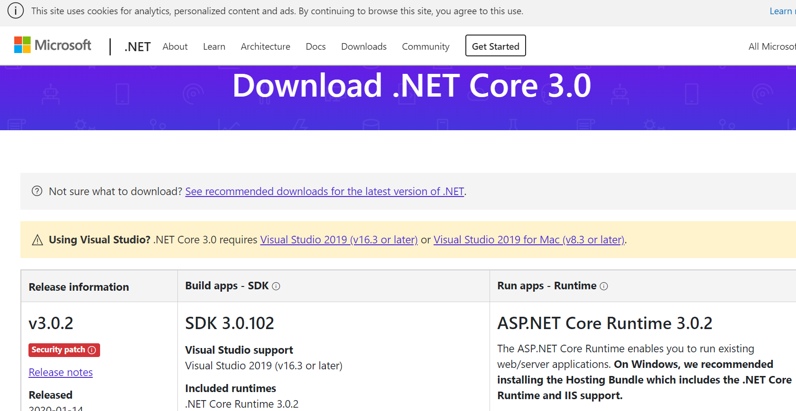

# Ejercicio de Markdown

## Instalación de dotnet core 2.2.
Lo primero que tenemos que hacer 
es bajar el archivo de instalación del siguiente
[lugar](https://dotnet.microsoft.com/download/dotnet-core/3.0).
Es importante bajar el SDK Core, por que **vamos a programar**.

La página se ve así:

## Instalación y configuración de Visual Studio Code para C#.

## Instalación de git. conectado a tu cuenta de GitHub y VSC